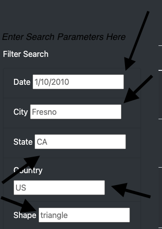
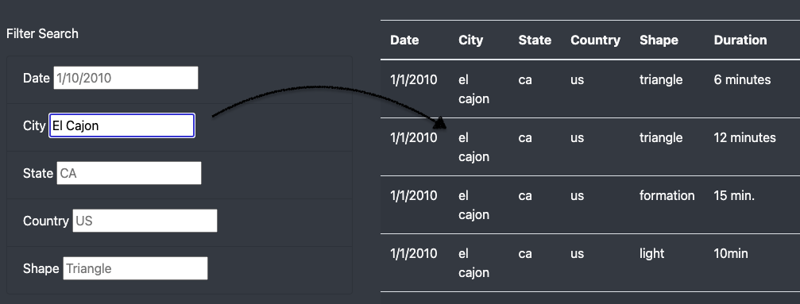
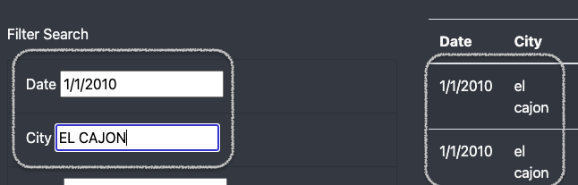
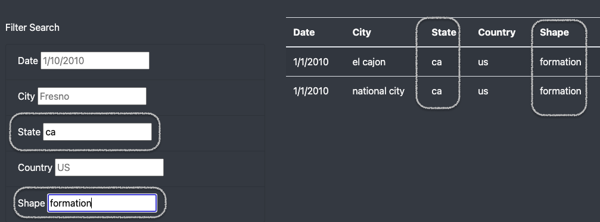

# UFOs_JavaScript
### Overview
---
The purpose of this project was to create an interactable list of UFO sightings, and be able to filter those sightings based on a number of criteria. The search criteria included Date, City, State, Country, as well as the Shape of the Uknown Object. The table of data, as well as the filters, would were to be laid out in a professional, organized, and eye-catching webpage. 
## Results
---
The table and its corresponding data loads beautifully, and the filter fields all respond as intended.    
In order to perform a search:   
1. Click on any of the search bars and type a value:      
     
*note: the example in the 'date' field is the correct format to search with.     
The fields are also NOT case sensitive.*    

2. Type a value into any field and hit *Enter ⮐*     
      

3. The list to the right will filter the results!    

4. Type in as many search criteria as you need to filter the results further:    
      
    
---    
## Summary      
---         

While fun to work on, and the website and table certainly function as intended, there are some drawbacks to it that, if improved, could further satiate the curiosity of any stargazer:     

* I believe the biggest drawback is that you have to guess the parameters to search for. Unless you scroll through the table and get a feel for the data, you won't know if there is a correct entry or not until you hit *Enter*, only to be greeted by an empty table.
* Aesthetically, I feel like it would be better to have a single input field with a dropdown menu for the parameter you want to filter. Every input entered would 'stack', creating a new field to allow searching for multiple parameters.
* Having radio buttons to *sort by* parameters would also be nice, such as grouping all events on a single date or city. Either that, or some kind of *suggestion* protocol or *autofill* function. 
 